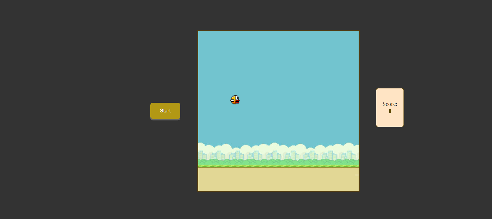

# Flappy bird

# Table of Contents

- [Flappy bird](#flappy-bird)
- [Table of Contents](#table-of-contents)
  - [Description](#description)
  - [Usage](#usage)
  - [Installation](#installation)
    - [1. Clone the Repository](#1-clone-the-repository)
    - [2. Run react](#2-run-react)
    - [3. Run tests](#3-run-tests)
  - [Contributing](#contributing)
  - [License](#license)

## Description

This is a webapp written in reactjs. You can play flappy bird here for free.


## Usage

To start/restart the game press 'Start button'. Press anywhere on screen with mouse or spacebar to make bird jump.

## Installation

Follow these steps to get started
### 1. Clone the Repository
```bash
git clone https://github.com/Vasya-556/Flappy-bird.git
cd Flappy-bird
```

### 2. Run react
```bash
cd frontend
npm start
```

### 3. Run tests
```bash
cd frontend
npm test
```

## Contributing

Pull requests are welcome.

## License

[MIT](LICENSE)

